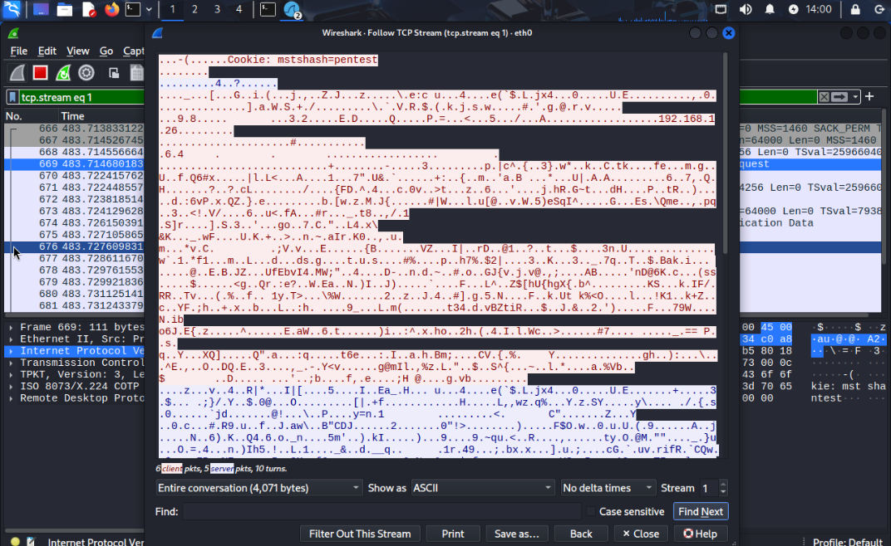

# Wireshark Traffic Analysis: RDP Login Simulation

## Objective
Capture and analyze Remote Desktop (RDP) traffic using Wireshark in a simulated attack lab environment.

## Environment
- **Attacker**: Kali Linux using `xfreerdp3`
- **Target**: Windows 11 VM (192.168.1.26)
- **Monitoring Tool**: Wireshark

## Simulation
Ran an RDP login attempt from Kali to the Windows machine using the following command:

```bash
xfreerdp3 /u:pentest /p:"wrongpass" /v:192.168.1.26 +auth-only /cert:ignore
```

## Wireshark Capture

Filter using 
```bash
ip.addr == 192.168.1.26 && tcp.port == 3389
```

## Observations
TCP handshake visible (SYN, SYN-ACK, ACK)

Encrypted RDP session follows

Source and destination IPs clearly identified

## Screenshots
### Packet Capture

### Follow TCP Stream


## Technical Breakdown: TCP Handshake and Follow TCP Stream

### What’s a TCP Handshake?
Every time two devices connect over TCP, they go through a “handshake”:

SYN – Kali says “Hey, I want to talk.”

SYN-ACK – Windows PC replies “Okay, I hear you.”

ACK – Kali confirms “Got it, let’s talk.”

Wireshark shows this — and that’s how you know an RDP connection was attempted.

### What Is “Follow TCP Stream” in Wireshark?
In simple terms:
It reconstructs the conversation between two devices.

Think of it like this:

All network packets are like puzzle pieces.
Wireshark's “Follow TCP Stream” puts them together so you can read the full back-and-forth.

Why it's useful:
It lets you see the full request and response, like commands sent or data transferred.

For unencrypted protocols (like HTTP, FTP, Telnet), you can see everything, including passwords.

For encrypted protocols (like RDP, HTTPS, SSH), you’ll just see scrambled data — but the connection itself is still visible, including the timing, length, and who’s talking to who.

## Key Takeaways
- Network traffic analysis can reveal connection attempts even if payloads are encrypted.
- RDP uses TCP port 3389 by default; monitoring this port is critical for detecting brute force or lateral movement attempts.
- Wireshark’s “Follow TCP Stream” is useful for examining session flow, even when data is encrypted.
- This lab reinforced how endpoint activity translates into observable network events.
